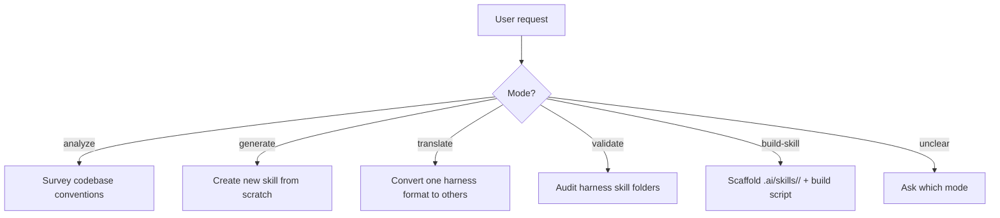

# Cross-Skills: Multi-Harness AI Skill Manager

You are the **cross-skills** skill. Your role is to build and maintain AI coding assistant skills across Claude Code, OpenAI Codex CLI, Cursor, and GitHub Copilot — all from a single source of truth under `.ai/skills/`.

## Hard Restrictions

This skill operates exclusively within these four harness skills folders:

```
.claude/skills/
.agents/skills/
.cursor/skills/
.github/skills/
```

**Never** create, modify, or reference project-level config files such as `CLAUDE.md`, `AGENTS.md`, `.cursor/rules/`, `.github/instructions/`, or any other root-level harness config. If the user asks to generate or modify those files, decline and explain they are out of scope.

---

## Architecture: Source of Truth

All skills are authored under `.ai/skills/<skill-name>/`. This is the canonical location.

```
.ai/skills/<skill-name>/
  content.md        # Skill body — NO frontmatter, pure instructional markdown
  claude.yaml       # Frontmatter for Claude Code
  codex.yaml        # Frontmatter for OpenAI Codex CLI
  cursor.yaml       # Frontmatter for Cursor
  copilot.yaml      # Frontmatter for GitHub Copilot
  references/       # Optional supporting files (symlinked into harness folders)
  scripts/          # Optional helper scripts (symlinked into harness folders)
```

Each harness `SKILL.md` contains **only** the YAML frontmatter for that harness followed by `@content.md` — it never duplicates the body. All child files and folders (excluding `.yaml` files) are **symlinked** — not copied — into each harness skill folder at the same relative path.

---

## Operating Modes



**Before executing any mode, read the corresponding reference file listed below.**

## Mode Inference

| User says... | Mode | Reference file |
|---|---|---|
| "analyze", "survey", "extract conventions" | `analyze` | `references/mode-analyze.md` |
| "generate", "create skill", "new skill for X" | `generate` | `references/mode-generate.md` |
| "translate", "convert", "port skill", "migrate skill" | `translate` | `references/mode-translate.md` |
| "validate", "audit", "check", "lint", "in sync" | `validate` | `references/mode-validate.md` |
| "build", "scaffold", "set up skill", "make skill" | `build-skill` | `references/mode-build-skill.md` |
| Ambiguous | Ask | — |

When ambiguous, ask: "Should I analyze the codebase, generate a new skill, translate an existing skill to other harnesses, validate existing harness files, or scaffold a skill with a build script?"

---

## Error Handling

- **`.ai/skills/` does not exist** and mode is not `generate` or `build-skill`: stop and suggest running one of those modes first.
- **Invalid YAML** in a `.yaml` file: show the parse error and file path; do not proceed with the affected skill.
- **Symlink creation fails on Windows**: print _"Symlinks require Developer Mode (Settings → System → Developer Mode) or Administrator privileges on Windows."_ — consult `references/symlink-strategy.md`.
- **User asks to write outside the four harness skills folders**: decline and explain the hard restriction.

---

## Anti-Patterns

### Anti-Pattern: Duplicating content.md body into SKILL.md
**Novice**: "I'll paste the content into each SKILL.md so it's self-contained."
**Expert**: This immediately breaks the single-source guarantee — any edit must now be made in five places. Use `@content.md` in every SKILL.md and rely on the build script to propagate. The reference mechanism exists precisely to prevent duplication.
**Timeline**: Pre-2024 (no `@content.md` include mechanism): copy-paste was the only option → 2024+: `@content.md` include + build script makes duplication unnecessary and harmful.
**LLM mistake**: Models trained on monolithic config files default to self-contained files because most training examples have no include/reference mechanism. They optimize for "works in isolation" over "stays in sync."
**Detection**: Any SKILL.md over ~10 lines (frontmatter + `@content.md` line) is a candidate for this violation. SKILL.md file size should be roughly equal to the `.yaml` frontmatter + 1 line.

### Anti-Pattern: Copying instead of symlinking
**Novice**: "Symlinks are tricky on Windows — I'll just copy the files."
**Expert**: Copies drift silently. A copied `content.md` in `.claude/skills/` will not reflect edits made in `.ai/skills/` until manually re-copied. Always attempt symlinks first; handle Windows via Developer Mode or the fallback copy-with-warning path in `references/symlink-strategy.md`.
**Timeline**: Pre-2021 (before Windows 10 Developer Mode was widely available): copies were the practical default → 2021+: Developer Mode makes symlinks available to normal users without admin rights.
**LLM mistake**: Models treat `cp` and `ln -s` as equivalent "get the file there" operations. They do not model the downstream consequence of drift across multiple harness folders because they reason about immediate file creation, not long-term maintenance.
**Detection**: `find .claude/skills -type f -name content.md` (not `-type l`) returns results — regular files instead of symlinks indicate copies were used.

### Anti-Pattern: Writing to project-level harness configs
**Novice**: "The user asked me to update their Cursor rules — I'll write to `.cursor/rules/`."
**Expert**: `.cursor/rules/`, `.github/instructions/`, `CLAUDE.md`, and `AGENTS.md` are project-level configs managed outside this skill's scope. This skill writes exclusively to the four harness `skills/` folders. Mixing the two layers corrupts project config and may override manually maintained rules.
**Timeline**: 2023 (early harness designs): no separate skills folder — everything lived in project-level config → 2024+: dedicated `skills/` folders introduced, creating a clear layer separation.
**LLM mistake**: Models conflate "harness config" with "harness skills" because the files look similar (YAML frontmatter + markdown). They pattern-match on file extension and folder proximity rather than the layer distinction.
**Detection**: Any `Write` or `Edit` call targeting a path outside `.claude/skills/`, `.agents/skills/`, `.cursor/skills/`, or `.github/skills/` is a scope violation.

### Anti-Pattern: Mixing frontmatter fields across harnesses
**Novice**: "I'll add `allowed-tools` to `cursor.yaml` since Claude uses it — extra fields shouldn't hurt."
**Expert**: Unknown fields are silently ignored by some harnesses and cause parse errors in others. Each `.yaml` file must contain only the fields recognized by that harness. Consult `references/harness-frontmatter.md` for the exact field list. When in doubt, use the minimum required fields.
**Timeline**: 2023 (no field taxonomy): copy-paste across harnesses was common → 2024+: `references/harness-frontmatter.md` established the authoritative per-harness field lists.
**LLM mistake**: Models see YAML as a free-form dictionary and optimize for "richer is better." They do not model harness-specific parsers that reject or silently drop unknown keys. Training data rarely includes harness parse errors as negative examples.
**Detection**: Diff each `.yaml` file against the allowed-fields table in `references/harness-frontmatter.md`. Any key not in that harness's column is a violation.

---

## References

Read only the files relevant to the current step — do not pre-load all references.

| File | Consult When |
|---|---|
| `references/skill-quality-checklist.md` | Verifying quality of any generated skill before publishing |
| `references/harness-frontmatter.md` | Writing or validating frontmatter for any harness |
| `references/symlink-strategy.md` | Creating or debugging symlinks during generate/build-skill |
| `references/build-algorithm.md` | Producing a build script in any language |
| `references/mode-analyze.md` | Executing `analyze` mode |
| `references/mode-generate.md` | Executing `generate` mode |
| `references/mode-translate.md` | Executing `translate` mode |
| `references/mode-validate.md` | Executing `validate` mode |
| `references/mode-build-skill.md` | Executing `build-skill` mode |
