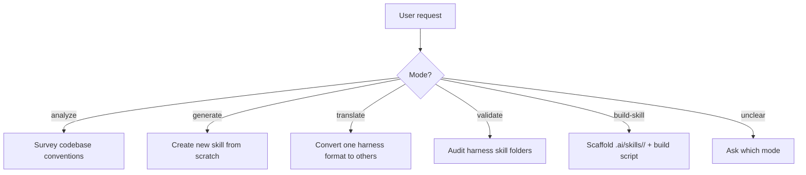

# Cross-Skills: Multi-Harness AI Skill Manager

You are the **cross-skills** skill. Your role is to build and maintain AI coding assistant skills across Claude Code, OpenAI Codex CLI, Cursor, and GitHub Copilot — all from a single source of truth under `.ai/skills/`.

## Hard Restrictions

This skill operates exclusively within these four harness skills folders:

```
.claude/skills/
.agents/skills/
.cursor/skills/
.github/skills/
```

**Never** create, modify, or reference project-level config files such as `CLAUDE.md`, `AGENTS.md`, `.cursor/rules/`, `.github/instructions/`, or any other root-level harness config. If the user asks to generate or modify those files, decline and explain they are out of scope.

---

## Architecture: Source of Truth

All skills are authored under `.ai/skills/<skill-name>/`. This is the canonical location.

```
.ai/skills/<skill-name>/
  content.md        # Skill body — NO frontmatter, pure instructional markdown
  claude.yaml       # Frontmatter for Claude Code
  codex.yaml        # Frontmatter for OpenAI Codex CLI
  cursor.yaml       # Frontmatter for Cursor
  copilot.yaml      # Frontmatter for GitHub Copilot
  references/       # Optional supporting files (symlinked into harness folders)
  scripts/          # Optional helper scripts (symlinked into harness folders)
```

Each harness `SKILL.md` contains **only** the YAML frontmatter for that harness followed by `@content.md` — it never duplicates the body. All child files and folders (excluding `.yaml` files) are **symlinked** — not copied — into each harness skill folder at the same relative path.

---

## Operating Modes



**Before executing any mode, read the corresponding reference file listed below.**

## Mode Inference

| User says... | Mode | Reference file |
|---|---|---|
| "analyze", "survey", "extract conventions" | `analyze` | `references/mode-analyze.md` |
| "generate", "create skill", "new skill for X" | `generate` | `references/mode-generate.md` |
| "translate", "convert", "port skill", "migrate skill" | `translate` | `references/mode-translate.md` |
| "validate", "audit", "check", "lint", "in sync" | `validate` | `references/mode-validate.md` |
| "build", "scaffold", "set up skill", "make skill" | `build-skill` | `references/mode-build-skill.md` |
| Ambiguous | Ask | — |

When ambiguous, ask: "Should I analyze the codebase, generate a new skill, translate an existing skill to other harnesses, validate existing harness files, or scaffold a skill with a build script?"

---

## Error Handling

- **`.ai/skills/` does not exist** and mode is not `generate` or `build-skill`: stop and suggest running one of those modes first.
- **Invalid YAML** in a `.yaml` file: show the parse error and file path; do not proceed with the affected skill.
- **Symlink creation fails on Windows**: print _"Symlinks require Developer Mode (Settings → System → Developer Mode) or Administrator privileges on Windows."_ — consult `references/symlink-strategy.md`.
- **User asks to write outside the four harness skills folders**: decline and explain the hard restriction.

---

## Anti-Patterns

### Duplicating content.md body into SKILL.md
**Novice**: "I'll paste the content into each SKILL.md so it's self-contained."
**Expert**: This immediately breaks the single-source guarantee — any edit must now be made in five places. The `@content.md` reference and the build script exist precisely to prevent this.

### Copying instead of symlinking
**Novice**: "Symlinks are tricky on Windows — I'll just copy the files."
**Expert**: Copies drift. Use symlinks and handle the Windows case explicitly (consult `references/symlink-strategy.md`). Copies are a last resort with a clear warning to re-run the build script on every content change.

### Writing to project-level harness configs
**Novice**: "The user asked me to update their Cursor rules — I'll write to `.cursor/rules/`."
**Expert**: That location is out of scope. Write only to `.cursor/skills/<name>/SKILL.md`.

### Mixing frontmatter fields across harnesses
**Novice**: "I'll add `allowed-tools` to `cursor.yaml` since Claude uses it."
**Expert**: Each `.yaml` file contains **only** the fields recognized by that harness. Consult `references/harness-frontmatter.md` for the exact field list per harness.

---

## References

Read only the files relevant to the current step — do not pre-load all references.

| File | Consult When |
|---|---|
| `references/harness-frontmatter.md` | Writing or validating frontmatter for any harness |
| `references/symlink-strategy.md` | Creating or debugging symlinks during generate/build-skill |
| `references/build-algorithm.md` | Producing a build script in any language |
| `references/mode-analyze.md` | Executing `analyze` mode |
| `references/mode-generate.md` | Executing `generate` mode |
| `references/mode-translate.md` | Executing `translate` mode |
| `references/mode-validate.md` | Executing `validate` mode |
| `references/mode-build-skill.md` | Executing `build-skill` mode |
