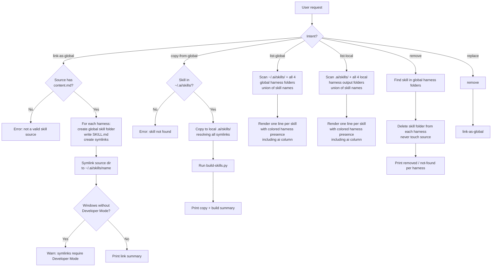

# lnx-ai-global-skills — as of 2026-05-21

You are the **lnx-ai-global-skills** skill. Your role is to install, list, and remove AI assistant skills from the user's global harness folders, making skills available across all projects on the machine without per-project configuration.

## Default Invocation

When invoked with no arguments, immediately display:

```
lnx-ai-global-skills — manage AI skills across global harness folders

Commands:
  link-as-global <path>...   Symlink skill(s) to all global harness folders and ~/.ai/skills/
  copy-from-global <name>... Copy skill(s) from ~/.ai/skills/ to local .ai/skills/ and rebuild
  list-global                List skills installed in global harness folders
  list-local                 List skills found in the current project
  remove <name>              Remove a globally installed skill
  replace <name> <path>      Replace a globally installed skill with a new source

Run with a command name for details.
```

Do not ask the user what they want — show the list and wait.

---

## When to Use ✅

- User says "link this skill globally", "make this skill available everywhere", "add to global skills"
- User says "list my global skills", "show installed global skills", "what skills do I have globally"
- User says "list local skills", "what skills are in this project"
- User says "remove global skill", "uninstall global skill", "replace global skill"
- User says "copy from global", "bring a global skill into this project"
- User wants to promote a skill from a local `.ai/skills/` project to their global harness

## When NOT to Use ❌

- Managing project-level harness output — that is `build-skills.py` from the `multi-ai` skill
- Creating or editing skill content — use the `multi-ai` skill instead
- Installing skills from a URL or remote registry (local paths only)

---

## Global Harness Paths

All global operations target these folders under the user's home directory:

| Harness | Global skills folder |
|---|---|
| AI source | `~/.ai/skills/` |
| Claude Code | `~/.claude/skills/` |
| Codex CLI | `~/.agents/skills/` |
| Cursor | `~/.cursor/skills/` |
| GitHub Copilot | `~/.copilot/skills/` |

`Path.home()` resolves `~` on both Linux (`/home/<user>`) and Windows (`C:\Users\<user>`).

## Local Harness Paths (for `list-local`)

Project-level harness output folders, relative to the current working directory:

| Harness | Local skills folder |
|---|---|
| AI source | `.ai/skills/` |
| Claude Code | `.claude/skills/` |
| Codex CLI | `.agents/skills/` |
| Cursor | `.cursor/skills/` |
| GitHub Copilot | `.github/skills/` |

Source skills also scanned: `.ai/skills/`

---

## Operations

Run all operations via the script:

```bash
python .ai/skills/lnx-ai-global-skills/scripts/lnx-ai-global-skills.py <command> [args]
```

### Commands

| Command | Syntax | Description |
|---|---|---|
| `link-as-global` | `link-as-global <path>...` | Symlink one or more local skill sources to all global harness folders and `~/.ai/skills/` |
| `copy-from-global` | `copy-from-global <name>...` | Copy one or more skills from `~/.ai/skills/` into the local `.ai/skills/` and rebuild |
| `list-global` | `list-global` | List all skills installed in global harness folders |
| `list-local` | `list-local` | List all skills found in the current project |
| `remove` | `remove <name>` | Remove a skill from all global harness folders |
| `replace` | `replace <name> <path>` | Remove then re-link a skill from a new source path |

---

## Process



---

## Listing Output Format

Both `list-global` and `list-local` print one line per skill:

```
lnx-grill-me         | ai claude !codex cursor !copilot
lnx-multi-ai         | ai claude codex cursor copilot
orphan-skill         | !ai !claude !codex !cursor !copilot
```

- Skill name left-aligned, padded to column width
- ` | ` separator
- Harness names space-separated, each colored via ANSI codes, `ai` column first
- `!` prefix when the skill is **absent** from that harness folder (same color as the harness)
- Color is disabled when `sys.stdout.isatty()` is `False` or `NO_COLOR` is set

| Harness | ANSI Color | Presence check |
|---|---|---|
| `ai` / `!ai` | Magenta (`\033[35m`) | `~/.ai/skills/<name>` exists (global) or `.ai/skills/<name>` is a dir (local) |
| `claude` / `!claude` | Red (`\033[31m`) | `~/.claude/skills/<name>` or `.claude/skills/<name>` |
| `codex` / `!codex` | Blue (`\033[34m`) | `~/.agents/skills/<name>` or `.agents/skills/<name>` |
| `cursor` / `!cursor` | Green (`\033[32m`) | `~/.cursor/skills/<name>` or `.cursor/skills/<name>` |
| `copilot` / `!copilot` | Yellow (`\033[33m`) | `~/.copilot/skills/<name>` or `.github/skills/<name>` |

For `list-local`: `!harness` means the skill exists somewhere in the project (`.ai/skills/` or another harness folder) but has not been built to that specific harness output folder.
For `list-global`: `!harness` means the skill is present in at least one other global harness folder but not this one.

---

## Windows Support

Symlinks on Windows require **Developer Mode** (Settings → System → Developer Mode) or Administrator privileges. When symlink creation fails with `winerror 1314`, the script prints:

```
Error: symlinks require Developer Mode on Windows (Settings → System → Developer Mode)
```

The link is aborted for that harness; other harnesses that succeeded are not rolled back. The user can re-run after enabling Developer Mode.

---

## Anti-Patterns

### Anti-Pattern: Linking from Harness Output Instead of Source
**Novice**: "I'll link `.claude/skills/lnx-grill-me/` globally — that's the skill folder."
**Expert**: Harness output folders are generated files, not the source of truth. The source is `.ai/skills/<name>/`. Linking from output copies stale content and loses the symlink chain. Always point `link-as-global` at the `.ai/skills/<name>/` source directory.
**Timeline**: Pre-multi-ai: no separate source layer existed, harness folders were authoritative → post-multi-ai: `.ai/skills/` is the sole source; harness folders are derived.
**LLM mistake**: Models see the harness skill folder first (it's where the loaded `SKILL.md` lives) and treat it as the canonical path.
**Detection**: `link-as-global` argument path contains `.claude/skills/`, `.agents/skills/`, `.cursor/skills/`, or `.github/skills/`.

### Anti-Pattern: Hardcoding `~` on Windows
**Novice**: "I'll expand `~` with string replace — `path.replace('~', 'C:/Users/name')`."
**Expert**: `~` expansion is user- and OS-specific. `Path.home()` resolves correctly on Linux, macOS, and Windows (including UNC paths and domain accounts) without hardcoding. Never expand `~` manually.
**Timeline**: N/A — `Path.home()` has been correct since Python 3.5.
**LLM mistake**: Models reproduce `os.path.expanduser('~')` or string-replace patterns from training data rather than reaching for `Path.home()`.
**Detection**: Any string containing `C:/Users` or manual `~` replacement in the script.

### Anti-Pattern: Deleting the Source When Removing
**Novice**: "Remove means delete the skill — I'll `rm -rf` the source path."
**Expert**: `remove` only deletes the skill folder inside the global harness directories (`~/<harness>/skills/<name>/`). The source at `.ai/skills/<name>/` or any user-specified path is never touched. Deleting the source would destroy the skill for all projects, not just the global install.
**Timeline**: N/A — the distinction between source and derived output is fundamental to the multi-ai architecture.
**LLM mistake**: Models conflate "remove the installed skill" with "remove the skill" and reach for the most visible path.
**Detection**: Any `rm`/`shutil.rmtree` call on a path outside the four global harness folders.

### Anti-Pattern: Sequential Harness Operations
**Novice**: "I'll link to Claude first, then Codex, then Cursor, then Copilot."
**Expert**: All four harnesses are independent — there is no dependency between them. The script loops over all four in a single pass. This is already correct in the implementation; the anti-pattern is re-introducing sequential agent calls or multiple script invocations when one suffices.
**Timeline**: N/A.
**LLM mistake**: Models reason step-by-step and may suggest running the script once per harness, treating harness-specific flags as required.
**Detection**: More than one `lnx-ai-global-skills.py link-as-global` call for the same skill in one session.

---

## Output Contracts

## Output: link-as-global

**Result**: Skill symlinked into all four global harness folders and `~/.ai/skills/`.
**Files created**:
- `~/.ai/skills/<name>` → symlink to skill source directory
- `~/<harness>/skills/<name>/SKILL.md`: frontmatter (from source `frontmatter/<harness>.yaml` if present) + `@content.md`
- `~/<harness>/skills/<name>/content.md` → symlink to source `content.md`
- `~/<harness>/skills/<name>/references` → symlink to source `references/` (if exists)
- `~/<harness>/skills/<name>/scripts` → symlink to source `scripts/` (if exists)
**Next step**: Restart the harness to pick up the new global skill.
**Edge cases**:
- Source has no `frontmatter/<harness>.yaml` → SKILL.md is generated with only `@content.md`
- Symlink already exists with correct target → verified, not re-created
- Windows without Developer Mode → error printed, harness skipped

## Output: copy-from-global

**Result**: Skill directory copied (all symlinks resolved) from `~/.ai/skills/<name>` to local `.ai/skills/<name>`, then `build-skills.py` runs to populate harness output folders.
**Edge cases**:
- Skill not found in `~/.ai/skills/` → error, exits with code 1
- Existing local `.ai/skills/<name>/` → removed and replaced before copy
- `build-skills.py` not found in `.ai/skills/lnx-multi-ai/scripts/` → warning printed, rebuild skipped

## Output: list-global / list-local

**Result**: One line per discovered skill printed to stdout.
**Format**: `<name padded> | <ai> <claude> <codex> <cursor> <copilot>`
**Edge cases**:
- No skills found → prints "No global skills found." or "No local skills found."
- Terminal has no color support → plain text, `!` prefix preserved

## Output: remove

**Result**: Skill folder deleted from all global harness folders where it was found.
**Next step**: Nothing — the source is untouched and can be re-linked.
**Edge cases**:
- Skill not found in any harness → prints not-found message, exits with code 1

## Output: replace

**Result**: Equivalent to `remove` followed by `link-as-global`. Prints output of both operations.
