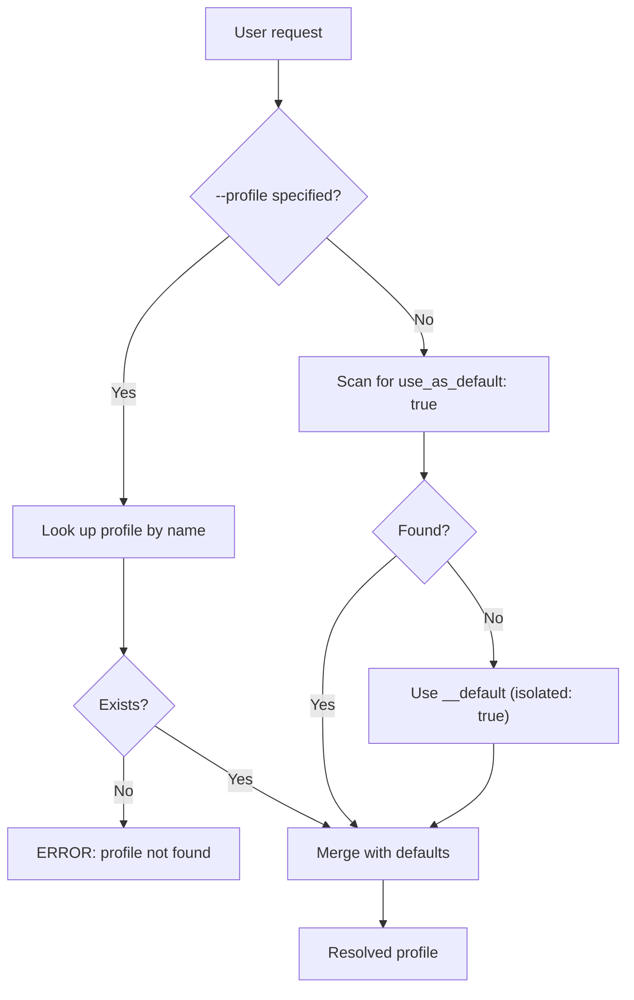
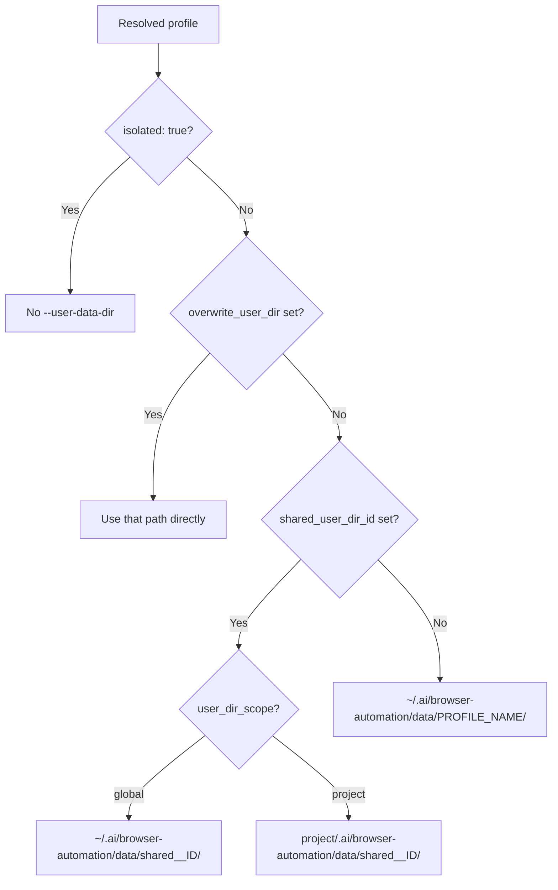

# Core Knowledge

## Prerequisite check

Before proposing commands, verify Playwright is available:

```bash
python "<skill-dir>/scripts/browser-automation.py" check-prereqs
```

If it fails, ask the user to install: `pip install playwright && playwright install`.

## Config structure

```yaml
ignore_home_config: true  # project-level only; skips global config entirely
default:
  browser: chrome       # unset by default (playwright defaults to chromium)
  headless: true        # true by default
  executable_path: "…"  # unset by default
profiles:
  my_profile:
    browser: firefox
    headless: false
    executable_path: "/path/to/browser"
    use_as_default: true
    extension_token: "token_value"
    overwrite_user_dir: "/custom/dir"
    shared_user_dir_id: shared_id
    user_dir_scope: "global"          # "global" (default) or "project"
    isolated: false                   # true = no persistent user data
```

| Option | Scope | Default | Description |
|---|---|---|---|
| `browser` | default + profile | _(unset → chromium)_ | `chrome`, `chromium`, `cr`, `firefox`, `ff`, `webkit`, `wk` |
| `headless` | default + profile | `true` | Run without visible window |
| `executable_path` | default + profile | _(unset)_ | Custom browser executable; set via env var |
| `extension_token` | default + profile | _(unset)_ | Sets `PLAYWRIGHT_MCP_EXTENSION_TOKEN` + `--extension` flag |
| `use_as_default` | profile only | `false` | Auto-select this profile when none specified |
| `isolated` | profile only | `false` | No persistent user data dir |
| `overwrite_user_dir` | profile only | _(unset)_ | Use exact path as user-data-dir (must exist) |
| `shared_user_dir_id` | profile only | _(unset)_ | Share data dir with profiles using same id |
| `user_dir_scope` | profile only | `"global"` | `"global"` or `"project"` for shared dirs |

## Config merging

Project-level overrides global-level, field by field and profile by profile. Set `ignore_home_config: true` in project config to discard global config entirely.

## Profile selection



## User data directory



## Commands

### resolve-config

```bash
python "<skill-dir>/scripts/browser-automation.py" resolve-config [--profile <name>]
```

### Output: resolve-config

**Result**: YAML with resolved profile settings
**Fields**: `profile`, `browser`, `channel`, `headless`, `isolated`, `user_data_dir`, `executable_path`, `extension_token`, `available_profiles`
**Next step**: Use the profile name with `build-cmd`

### build-cmd

```bash
python "<skill-dir>/scripts/browser-automation.py" build-cmd <command> [--profile <name>] [--exec] [-- extra-args...]
```

Where `<command>` is: `open`, `screenshot`, `pdf`, `codegen`.

### Output: build-cmd

**Result**: Full playwright CLI command string printed to stdout
**With `--exec`**: Prints command then executes it; exits with playwright's return code
**Next step**: If no `--exec`, run the printed command via Bash

## Workflow

1. User asks to perform a browser task
2. Run `resolve-config` to check available profiles and settings
3. Run `build-cmd` with the appropriate command and `--exec`
4. For `screenshot`/`pdf`: report the output file path to the user

## Headless behavior

- `headless: true` adds `--headless` to the command
- `codegen` always runs headed — script prints a warning and ignores `headless`
- `open` supports headless mode normally
- `screenshot` and `pdf` are inherently headless

## Guardrails

- Always use the helper script — never run `playwright` directly; the script resolves browser, channel, user-data-dir, executable path, and extension token from config
- Always run `resolve-config` first to understand the active profile before building commands
- Pass one-off flags via `-- extra-args`, not by editing config files
- Prefer `--exec` to run immediately rather than copy-pasting the output command
- When the user says "use chrome" or similar, match against profile names or browser types — do not guess flags
