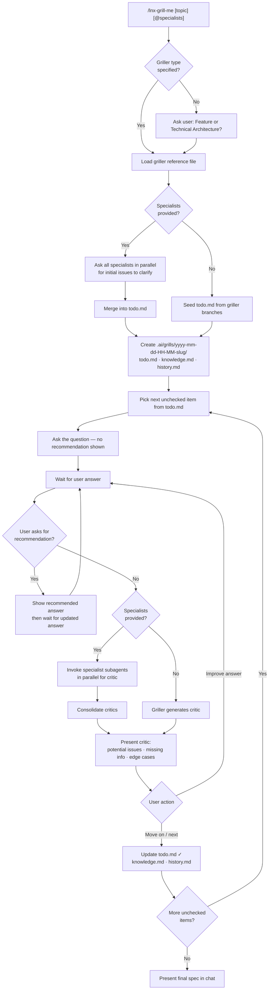

# lnx-grill-me: Interview Process

Full workflow, question protocol, specialist integration, session file formats, and output contract.

---

## Grillers

A **griller** defines the domain and the design tree to walk. Load the chosen griller at session start — it declares the branches to walk and domain-specific question prompts.

| Griller | Reference file | Use when |
|---|---|---|
| Generalist Feature Griller | `references/feature-griller.md` | Business feature, user-facing capability |
| Generalist Technical Architecture Griller | `references/technical-griller.md` | System design, technical approach, architecture |
| Game Feature Griller | `references/game-feature-griller.md` | Game mechanic, mode, or player-facing capability |
| Unity 3D Technical Griller | `references/unity3d-technical-griller.md` | Unity system, pattern, or infrastructure concern |

Custom grillers can be added as `references/<name>-griller.md`.

If the user does not name a griller type, ask once: **Feature spec or Technical Architecture spec?** — then load the matching reference.

---

## Specialist Skills

The user may supply specialist skills at invocation:

```
/lnx-grill-me @security @domain-expert "user auth flow"
```

**At session start** — consult all specialists in parallel (one subagent per skill) and ask each: *"Given this topic, what issues, risks, or decisions should be clarified in the grilling process?"* Merge their responses into `todo.md`.

**At critique phase** — after the user's answer, invoke each relevant specialist subagent in parallel to critique that answer from their domain lens. Consolidate their outputs into a single critic block before presenting.

Always use parallelism — never consult specialists sequentially.

---

## Interview Flow



---

## Question Protocol

- Ask **one question per turn** — never stack multiple questions
- Do **not** show your recommended answer upfront — only reveal it if the user explicitly asks (e.g. "what do you recommend?", "what would you suggest?")
- After every accepted answer, write a **critic block** covering:
  - Potential issues with the answer
  - Possibly missing information
  - Edge cases not yet addressed
- The user may then **refine their answer** or say **"move on"** / **"next"** to proceed
- If the user says "skip", mark the item in `todo.md` as skipped `[-]` and move on without writing a critic

---

## Session Folder & Files

Create `.ai/grills/yyyy-mm-dd-HH-MM-<slug>/` at session start.

- `<slug>` = kebab-case of the first 4–5 words of the topic (e.g. `user-auth-flow`)
- Example path: `.ai/grills/2026-05-21-14-30-user-auth-flow/`

### `todo.md`

```markdown
# Grill: <topic>

## Pending
- [ ] <branch question 1>
- [ ] <branch question 2>

## Done
- [x] <completed branch>
- [-] <skipped branch>
```

### `knowledge.md`

```markdown
# Knowledge: <topic>

## <Branch Name>
<Consolidated answer from this branch>
```

### `history.md`

Append-only log of every Q/A/Critic exchange.

```markdown
# History: <topic>

---
**Q**: <question text>
**A**: <user's final answer>
**Critic**: <critic text>
---
```

**All three files are updated** after every accepted answer (before moving to the next question).

---

## Output Contract

## Output: Final Specification

**Result**: A complete Markdown specification presented in chat at the end of the grilling session.
**Format**:
```markdown
# [Spec Type] Spec: <topic>

## Summary
<One-paragraph overview>

## <Branch 1 Name>
<Consolidated knowledge from this branch>

## <Branch 2 Name>
...
```
**File written**: None by default. If the user asks to save it, write to `.ai/grills/<session>/spec.md`.
**Edge cases**:
- If the user ends the session early (says "done", "stop", "finalize"), generate the spec with whatever knowledge has been gathered and note incomplete sections.
- If no answers were accepted, present an empty spec skeleton and note that no branches were completed.
