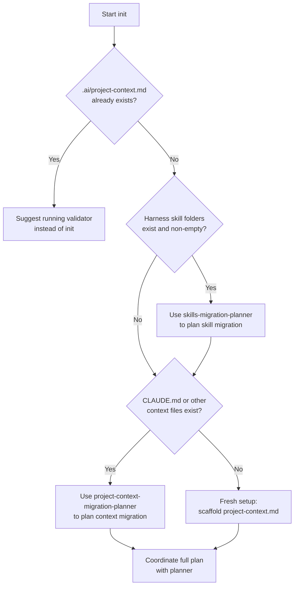

# Init Planner

Use this reference when initializing a project in the lnx-multi-ai format from scratch, or when setting it up for the first time in a repo that may have existing agent configuration.

**Also read**:
- `references/planner.md` — always; provides the Project-Context vs Skills gate and plan generation
- `references/skills-migration-planner.md` — if existing harness skill configurations are found
- `references/project-context-migration-planner.md` — if existing harness context files are found

---

## Step 1 — Detect Existing Configuration



### What to scan for

| Location | What it indicates |
|---|---|
| `.ai/project-context.md` | Already in lnx-multi-ai format — validate instead |
| `.claude/skills/`, `.agents/skills/`, `.cursor/skills/`, `.github/skills/` | Existing harness skills to migrate |
| `CLAUDE.md`, `AGENTS.md` (non-symlink) | Context content to migrate to `.ai/project-context.md` |
| `.cursorrules`, `.github/copilot-instructions.md` | Context content to migrate |
| `.cursor/rules/*.mdc`, `.github/instructions/*.md` | Context content to migrate (and then delete those folders) |

---

## Step 2 — Fresh Setup (no existing config)

If no existing harness configuration is found:

1. Ask the user for each of the 7 project-context sections (allow "skip / fill later" for any):
   - Project name + one-sentence description
   - Tech Stack
   - Architecture
   - Project Structure
   - Workflow Quick Overview
   - MCPs (if any)
   - Core Skills (if any)

2. Write `.ai/project-context.md` with the populated content

3. Run the build script to create symlinks:
   ```bash
   python .ai/skills/lnx-multi-ai/scripts/build-context.py
   ```

4. Ask whether they want to create an initial skill now — if yes, coordinate with `planner` and `skill-builder`

5. Print a summary of all files created and next steps

---

## Step 3 — Coordinate the Full Plan

Whether fresh or migrating, produce a consolidated plan before executing:

```
Init plan for <project>

Phase 1 — Context migration (N items)
  [table from project-context-migration-planner if applicable]

Phase 2 — Skills migration (N skills)
  [table from skills-migration-planner if applicable]

Phase 3 — Fresh content
  Create .ai/project-context.md with: <sections listed>
  Create .ai/skills/<name>/ for: <skill listed>

Proceed? (yes / no / edit plan)
```

Do not execute any phase until the user approves the full plan.
