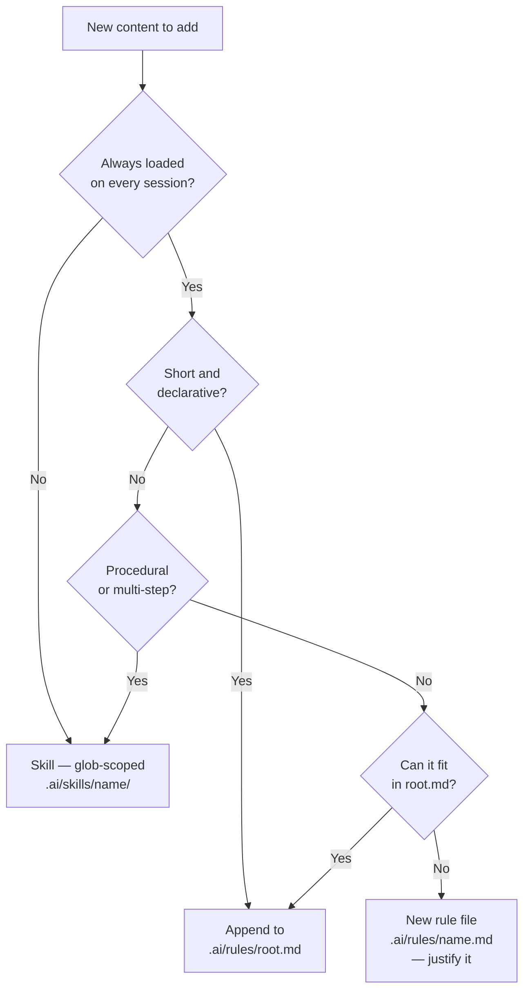

# Planner

Use this reference when designing or reviewing skills and rules. Do NOT load it for simple edits or for writing already-designed content.

**Also read**:
- `references/skill-design-guidelines.md` — when designing or reviewing a skill
- `references/rules-design-guidelines.md` — when designing or reviewing a rule

---

## Rules vs Skills Gate

Before planning any new skill or rule, classify the content:

| Content type | Decision |
|---|---|
| Always-on project context (description, stack, structure, MCPs) | Rule → append to `.ai/rules/root.md` |
| Short always-applicable invariants | Rule → append to `.ai/rules/root.md` (prefer over new file) |
| Genuinely separate, always-on, too long for root.md | Rule → new `.ai/rules/<name>.md` (justify it) |
| Detailed workflows, coding conventions, testing patterns | Skill → `.ai/skills/<name>/` |
| Tool configuration (lint, format, typecheck) | Neither — config files are authoritative |
| Context-specific knowledge (only certain files or tasks) | Skill → glob-scoped, `.ai/skills/<name>/` |
| Procedural multi-step process | Skill → `.ai/skills/<name>/` |



### What NOT to put in rules (redirect these to skills)

- **Code style** — ESLint, Prettier, Biome, Ruff rules belong in config files; the agent reads them directly
- **Context-specific knowledge** — if it only applies when working on certain files or tasks, it's a glob-scoped skill
- **Procedural workflows** — multi-step processes belong in skills

---

## Generating a High-Level Plan

When the task is design or review (not simple editing), generate a plan with this structure:

```markdown
## Plan: [Goal]

### What changes
| File | Action | Reason |
|---|---|---|
| `.ai/skills/<name>/content.md` | Create | New skill for X |
| `.ai/rules/root.md` | Edit — add section Y | Context always needed |

### Sections to create or edit
- **content.md § When to use**: list concrete trigger phrases for X
- **content.md § Anti-patterns**: add pattern for [specific mistake]
- **root.md § Tech Stack**: add framework Z

### General approach
<2–3 sentences on the overall strategy>

### Not in scope
<What is explicitly excluded from this change>
```

Stop and confirm the plan with the user before executing. Do not combine planning and execution in the same step.

---

## When NOT to Plan

Skip this reference entirely when:
- Writing content that is already fully designed (user gave you a spec)
- Making a simple edit (fix a typo, update a version number, add one bullet)
- Executing a previously approved plan
