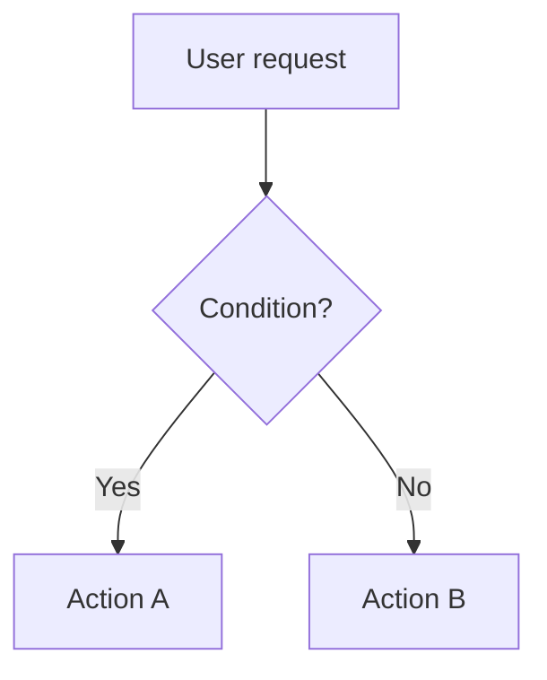

# Skill Design Guidelines

Best practices, required sections, anti-patterns, and the quality gate for skills.

---

## Description Formula

Every skill description (in all four `frontmatter/*.yaml` files) must follow:

```
[What it does] [When to use it] [Trigger keywords]. NOT for [Exclusions].
```

- Length: 25–50 words ideal, 100 words maximum
- Must contain at least one explicit NOT clause naming specific exclusions
- Trigger keywords must match words users actually type

---

## SKILL.md Size Tiers

`content.md` line count governs which tier a skill belongs to. Choose the smallest tier that fits.

| Tier | Max lines | When to use |
|---|---|---|
| **Micro** | 35 | Hard directioning only — best practices or hard workflow constraints that must always apply |
| **Small** | 60 | Same intent as Micro; use when 25 lines is genuinely not enough |
| **Medium** | 125 | Most skills — generic coding, testing, tooling specialists |
| **Big** | 250 | Full specialist, knowledge base, or feature spec used as the primary skill in a prompt |
| **Huge** | 500 | Avoid at all costs. Requires explicit user permission before writing. |

**Default target**: Small (≤60 lines). If you reach Big, ask whether content can be moved to `references/`. If you reach Huge, stop and ask the user for permission.

---

## Preferred content.md structure

`content.md` is for activation routing and minimum survival knowledge only. Deep knowledge, workflows, anti-pattern details, and reference material belong in `references/*.md` files loaded on demand.

Prefer five fixed sections in `content.md`:

- **`## Description`** — One or two sentences. What this skill does and its core purpose.
- **`## Activate me when...`** — Up to 3 bullet points. Concrete trigger phrases or conditions that signal this skill should be loaded.
- **`## Do NOT activate me when...`** — Up to 3 bullet points. Concrete exclusions; at least one realistic false-positive the model might otherwise make.
- **`## References table`** — References table to `references/*.md` files. Each row must include a "Load when" condition so the model only loads what the current task requires.
- **`## Minimum Knowledge`** — Up to 6 bullet points. The essential instructions a model must follow if the context is too crowded to load any reference files. Must be self-contained and actionable without any references.

### Preferred content.md skeleton

```markdown
# <skill-name> — as of YYYY-MM-DD

## Description

<One or two sentences describing what this skill does.>

## Activate me when...

- <Concrete trigger condition 1>
- <Concrete trigger condition 2>
- <Concrete trigger condition 3>

## Do NOT activate me when...

- <Exclusion 1>
- <Exclusion 2>
- <Exclusion 3>

## References table

| File | Load when |
|---|---|
| `references/core-knowledge.md` | Always — foundational rules and patterns |
| `references/<topic>.md` | <Condition> |

## Minimum Knowledge

- <Essential directive 1>
- <Essential directive 2>
- <Essential directive 3>
- <Essential directive 4>
- <Essential directive 5>
- <Essential directive 6>
```

### References discipline

- Anti-patterns must never appear in `content.md`. Place them in `references/core-knowledge.md` or in the `references/*.md` file that best matches their context (e.g., `references/anti-patterns.md`).
- Complex output contracts must not appear in `content.md`. Place them in the relevant `references/*.md` file.
- Each `references/*.md` file must have a distinct loading condition. Do not create multiple files that are always loaded together — consolidate them into a single file (prefer `references/core-knowledge.md` when all knowledge must always be enabled).
- Prefer `references/core-knowledge.md` for a single topic. When a skill covers multiple distinct topics with different load conditions, split into separate files (e.g., `references/listing-models.md`, `references/editing-models.md`).
- Never put deep knowledge directly in `content.md`.

---

## Required `content.md` Sections

| Section | Requirement |
|---|---|
| Purpose statement | One sentence with `as of [YYYY-MM-DD]` on the same line |
| When to use ✅ | Concrete trigger phrases; specific conditions |
| When NOT to use ❌ | Concrete exclusions; at least one realistic false-positive prevented |
| Process / decision flow | Step-by-step or Mermaid `flowchart TD` — required for any branching logic |
| Minimum Knowledge | Up to 6 self-contained bullet points; actionable without loading any references |
| References table | Every `references/*.md` file listed; each row needs a "Load when" condition |
| Output contracts | Simple contracts inline; complex contracts in `references/*.md` (see format below) |
| `frontmatter/` | All four `<harness>.yaml` files present — regardless of which harnesses are enabled in `.ai/config.yml` |

### Mermaid Flowchart Rule

Every branching decision **must** have a Mermaid diagram. No exceptions.



### Output Contract Format

```markdown
## Output: [Mode or Action Name]

**Result**: <summary of what was done>
**Files created**:
- `<path>`: <purpose>
**Next step**: <what the user should do next>
```

Document edge cases: what happens when input is missing, a step fails, or the output already exists.

---

## Anti-Pattern Template

Copy this block for each anti-pattern (minimum 3 per skill):

```markdown
### Anti-Pattern: [Short Name]
**Novice**: "[Wrong assumption stated as the novice would say it]"
**Expert**: [Why it is wrong + the correct approach in 2–4 sentences]
**Timeline**: [Date/version]: [old behavior] → [Date/version]: [new behavior]
**LLM mistake**: [Why language models default to the wrong pattern]
**Detection**: [Concrete signal that this anti-pattern is present]
```

---

## Anti-Patterns for Multi-AI Skills

### Anti-Pattern: Duplicating content.md body into SKILL.md
**Novice**: "I'll paste the content into each SKILL.md so it's self-contained."
**Expert**: This immediately breaks the single-source guarantee — any edit must be made in five places. Use `@content.md` in every SKILL.md and rely on the build script to propagate. The reference mechanism exists precisely to prevent duplication.
**Timeline**: Pre-2024 (no `@content.md` include): copy-paste was the only option → 2024+: `@content.md` makes duplication unnecessary and harmful.
**LLM mistake**: Models trained on monolithic config files default to self-contained files because training examples have no include mechanism.
**Detection**: Any SKILL.md over ~10 lines (frontmatter + `@content.md`) is a candidate for this violation.

### Anti-Pattern: Copying instead of symlinking
**Novice**: "Symlinks are tricky on Windows — I'll just copy the files."
**Expert**: Copies drift silently. A copied `content.md` will not reflect edits to `.ai/skills/` until manually re-copied. Always attempt symlinks first; handle Windows via Developer Mode or the fallback copy-with-warning path.
**Timeline**: Pre-2021 (before Windows Developer Mode): copies were the practical default → 2021+: Developer Mode makes symlinks available without admin rights.
**LLM mistake**: Models treat `cp` and `ln -s` as equivalent "get the file there" operations. They do not model downstream drift consequences.
**Detection**: `find .claude/skills -type f -name content.md` returns results — regular files instead of symlinks indicate copies were used.

### Anti-Pattern: Writing to project-level harness configs
**Novice**: "The user asked me to update their Cursor rules — I'll write to `.cursor/rules/`."
**Expert**: `.cursor/rules/`, `.github/instructions/`, `CLAUDE.md`, and `AGENTS.md` are project-level configs managed outside this skill's scope. This skill writes exclusively to `.ai/` source files. Mixing the two layers corrupts project config and may override manually maintained rules.
**Timeline**: 2023 (early harness designs): no separate skills folder, everything in project-level config → 2024+: dedicated `skills/` folders introduced, creating a clear layer separation.
**LLM mistake**: Models conflate "harness config" with "harness skills" because files look similar (YAML frontmatter + markdown).
**Detection**: Any `Write` or `Edit` call targeting a path outside `.ai/skills/` or `.ai/project-context.md` is a scope violation.

### Anti-Pattern: Mixing frontmatter fields across harnesses
**Novice**: "I'll add `allowed-tools` to `cursor.yaml` since Claude uses it — extra fields shouldn't hurt."
**Expert**: Unknown fields are silently ignored by some harnesses and cause parse errors in others. Each `.yaml` file must contain only the fields recognized by that harness. Consult `skill-frontmatter-expert.md` for the exact field list per harness.
**Timeline**: 2023 (no field taxonomy): copy-paste across harnesses was common → 2024+: per-harness field lists established the authoritative boundaries.
**LLM mistake**: Models see YAML as a free-form dictionary and optimize for "richer is better." They do not model harness-specific parsers that reject unknown keys.
**Detection**: Diff each `.yaml` file against the allowed-fields table in `skill-frontmatter-expert.md`. Any key not in that harness's column is a violation.

---

## 10-Axis Quality Rubric

Before publishing any skill, verify each axis passes:

| Axis | Checks |
|---|---|
| 1 — Description Quality (2×) | Follows formula; 25–50 words; NOT clause is specific |
| 2 — Scope Discipline (2×) | One expertise domain; concrete trigger phrases; concrete exclusions |
| 3 — Progressive Disclosure | content.md fits its size tier (see Size Tiers table); Huge requires user permission; content.md contains only activation rules and Minimum Knowledge (≤6 bullets); anti-patterns and complex contracts in `references/`; References table lists every ref with a distinct load condition |
| 4 — Anti-Pattern Coverage | ≥3 anti-patterns; all 5 fields present; timelines use concrete dates; should be written at referred references/* markdown files |
| 5 — Self-Contained Tools | Scripts are complete; error handling present; dependencies documented |
| 6 — Activation Precision | Domain-specific keywords; NOT clause prevents realistic false-positive; no unexplained overlap |
| 7 — Visual Artifacts | Mermaid diagram for every branch; tables for multi-column comparisons |
| 8 — Output Contracts | Each mode has explicit output format; `<placeholder>` slots; edge cases documented |
| 9 — Temporal Awareness | `as of [YYYY-MM-DD]` in content.md; `CHANGELOG.md` with dated entry |
| 10 — Documentation Quality | CHANGELOG follows `## [version] — YYYY-MM-DD`; self-describing reference filenames |
| 11 — Limited Depth | Each `references/*.md` file ideally under 150 lines; total `references/` files ≤6 |

---

## Pre-Publish Gate (run in order)

0. Confirm all four `frontmatter/*.yaml` files exist
1. Word-count the description — trim if >100 words
2. Count anti-patterns — must be ≥3 with all 5 fields
3. Check every branching flow has a Mermaid diagram
4. Confirm `CHANGELOG.md` exists with a dated `[0.1.0]` entry
5. Confirm `as of [date]` marker is in `content.md`
