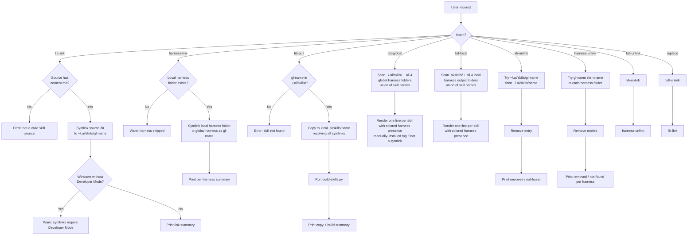

# skills-lib — as of 2026-05-22

You are the **skills-lib** skill. Your role is to install, list, and remove AI assistant skills from the user's global harness folders, making skills available across all projects on the machine without per-project configuration.

## Default Invocation

When invoked with no arguments, immediately display:

```
skills-lib — manage AI skills across global harness folders

Commands:
  lib-link <path>...                      Symlink skill source(s) to ~/.ai/skills/ as gl-<name>
  harness-link <name>... [--harnesses h]  Link local harness output(s) to global harness folders as gl-<name>
  lib-pull <name>...                      Copy skill(s) from ~/.ai/skills/gl-<name> to local .ai/skills/ and rebuild
  list-global                             List skills installed in global harness folders
  list-local                              List skills found in the current project
  lib-unlink <name>...                    Remove skill(s) from ~/.ai/skills/
  harness-unlink <name>... [--harnesses h] Remove skill(s) from global harness folders
  full-unlink <name>...                   Remove skill(s) from all global locations
  replace <name> <path>                   Replace a globally installed skill with a new source

Run with a command name for details.
```

Do not ask the user what they want — show the list and wait.

---

## When to Use ✅

- User says "link this skill to the global lib", "make this skill available everywhere", "add to global skills"
- User says "link this skill to global harnesses", "expose built skill globally"
- User says "list my global skills", "show installed global skills", "what skills do I have globally"
- User says "list local skills", "what skills are in this project"
- User says "remove global skill", "uninstall global skill", "replace global skill"
- User says "pull from global", "bring a global skill into this project"
- User wants to promote a skill from a local `.ai/skills/` project to their global library

## When NOT to Use ❌

- Managing project-level harness output — that is `build-skills.py` from the `multi-ai` skill
- Creating or editing skill content — use the `multi-ai` skill instead
- Installing skills from a URL or remote registry (local paths only)

---

## Global Harness Paths

All global operations target these folders under the user's home directory:

| Harness | Global skills folder |
|---|---|
| AI source | `~/.ai/skills/` |
| Claude Code | `~/.claude/skills/` |
| Codex CLI | `~/.agents/skills/` |
| Cursor | `~/.cursor/skills/` |
| GitHub Copilot | `~/.copilot/skills/` |

`Path.home()` resolves `~` on both Linux (`/home/<user>`) and Windows (`C:\Users\<user>`).

## Local Harness Paths (for `list-local` and `harness-link`)

Project-level harness output folders, relative to the current working directory:

| Harness | Local skills folder |
|---|---|
| AI source | `.ai/skills/` |
| Claude Code | `.claude/skills/` |
| Codex CLI | `.agents/skills/` |
| Cursor | `.cursor/skills/` |
| GitHub Copilot | `.github/skills/` |

Source skills also scanned: `.ai/skills/`

---

## Operations

Run all operations via the script. `<base_dir>` is the "Base directory for this skill" path from the invocation header.

```bash
python "<base_dir>/scripts/skills-lib.py" <command> [args]
```

### Commands

| Command | Syntax | Description |
|---|---|---|
| `lib-link` | `lib-link <path>...` | Symlink one or more skill source directories to `~/.ai/skills/` as `gl-<name>` |
| `harness-link` | `harness-link <name>... [--harnesses h1,h2]` | Link local harness output folder(s) to global harness folders as `gl-<name>`; defaults to all harnesses |
| `lib-pull` | `lib-pull <name>...` | Copy one or more skills from `~/.ai/skills/gl-<name>` into local `.ai/skills/<name>` and rebuild |
| `list-global` | `list-global` | List all skills installed in global harness folders |
| `list-local` | `list-local` | List all skills found in the current project |
| `lib-unlink` | `lib-unlink <name>...` | Remove one or more skills from `~/.ai/skills/` |
| `harness-unlink` | `harness-unlink <name>... [--harnesses h1,h2]` | Remove one or more skills from global harness folders; defaults to all harnesses |
| `full-unlink` | `full-unlink <name>...` | Remove one or more skills from all global locations (calls `lib-unlink` + `harness-unlink`) |
| `replace` | `replace <name> <path>` | Full-unlink then re-link a skill from a new source path |

---

## Process



---

## Listing Output Format

Both `list-global` and `list-local` print one line per skill:

```
lnx-grill-me         | ai claude !codex cursor !copilot
multi-ai         | ai claude codex cursor copilot
orphan-skill         | !ai !claude !codex !cursor !copilot
gl-lnx-old-skill     | ai claude codex cursor copilot | manually-installed
```

- Skill name left-aligned, padded to column width
- ` | ` separator
- Harness names space-separated, each colored via ANSI codes, `ai` column first
- `!` prefix when the skill is **absent** from that harness folder (same color as the harness)
- ` | manually-installed` appended when any existing global folder for the skill is NOT a symlink
- Color is disabled when `sys.stdout.isatty()` is `False` or `NO_COLOR` is set

| Harness | ANSI Color | Presence check |
|---|---|---|
| `ai` / `!ai` | Magenta (`\033[35m`) | `~/.ai/skills/<name>` exists (global) or `.ai/skills/<name>` is a dir (local) |
| `claude` / `!claude` | Red (`\033[31m`) | `~/.claude/skills/<name>` or `.claude/skills/<name>` |
| `codex` / `!codex` | Blue (`\033[34m`) | `~/.agents/skills/<name>` or `.agents/skills/<name>` |
| `cursor` / `!cursor` | Green (`\033[32m`) | `~/.cursor/skills/<name>` or `.cursor/skills/<name>` |
| `copilot` / `!copilot` | Yellow (`\033[33m`) | `~/.copilot/skills/<name>` or `.github/skills/<name>` |

For `list-local`: `!harness` means the skill exists somewhere in the project (`.ai/skills/` or another harness folder) but has not been built to that specific harness output folder.
For `list-global`: `!harness` means the skill is present in at least one other global harness folder but not this one.

---

## Global Symlink Naming

All global entries created by `lib-link` and `harness-link` use the `gl-` prefix:

| Location | Entry name |
|---|---|
| `~/.ai/skills/` | `gl-<source-dir-name>` |
| `~/.claude/skills/` | `gl-<skill-name>` |
| `~/.agents/skills/` | `gl-<skill-name>` |
| `~/.cursor/skills/` | `gl-<skill-name>` |
| `~/.copilot/skills/` | `gl-<skill-name>` |

The `gl-` prefix distinguishes managed symlinks from manually placed skill folders in `list-global` output.

Unlink commands (`lib-unlink`, `harness-unlink`, `full-unlink`) accept skill names with or without the `gl-` prefix and try `gl-<name>` first.

---

## Windows Support

Symlinks on Windows require **Developer Mode** (Settings → System → Developer Mode) or Administrator privileges. When symlink creation fails with `winerror 1314`, the script prints:

```
Error: symlinks require Developer Mode on Windows (Settings → System → Developer Mode)
```

The link is aborted for that harness; other harnesses that succeeded are not rolled back. The user can re-run after enabling Developer Mode.

---

## Anti-Patterns

### Anti-Pattern: Using lib-link When harness-link Is Needed (or Vice Versa)
**Novice**: "I'll use lib-link to get the skill into Claude globally."
**Expert**: `lib-link` only creates a symlink in `~/.ai/skills/` (the AI source layer). To expose built skill content in harness folders (`~/.claude/skills/`, etc.), use `harness-link` which symlinks the local harness output. Use `lib-link` when you want to share the source across machines via `lib-pull`; use `harness-link` when you want the compiled harness output immediately available globally.
**LLM mistake**: Models use lib-link expecting it to also populate harness folders like the old `link-as-global` did.
**Detection**: User complains the skill isn't visible in their harness after `lib-link`.

### Anti-Pattern: Linking from Harness Output with lib-link
**Novice**: "I'll run lib-link .claude/skills/lnx-grill-me/ — that's the skill folder."
**Expert**: `lib-link` expects the skill SOURCE directory (`.ai/skills/<name>/`), which must contain `content.md`. Harness output folders are generated files; linking them to `~/.ai/skills/` would break `lib-pull` because the source wouldn't contain `content.md` at the root. Use `harness-link` if you want to link harness output directly.
**LLM mistake**: Models see the harness skill folder first (it's where the loaded `SKILL.md` lives) and treat it as the canonical path for lib-link.
**Detection**: `lib-link` argument path contains `.claude/skills/`, `.agents/skills/`, `.cursor/skills/`, or `.github/skills/`.

### Anti-Pattern: Hardcoding `~` on Windows
**Novice**: "I'll expand `~` with string replace — `path.replace('~', 'C:/Users/name')`."
**Expert**: `~` expansion is user- and OS-specific. `Path.home()` resolves correctly on Linux, macOS, and Windows (including UNC paths and domain accounts) without hardcoding. Never expand `~` manually.
**LLM mistake**: Models reproduce `os.path.expanduser('~')` or string-replace patterns from training data rather than reaching for `Path.home()`.
**Detection**: Any string containing `C:/Users` or manual `~` replacement in the script.

### Anti-Pattern: Deleting the Source When Unlinking
**Novice**: "Unlink means delete the skill — I'll `rm -rf` the source path."
**Expert**: All unlink commands only delete the entry inside the global harness directories or `~/.ai/skills/`. The source at `.ai/skills/<name>/` or any user-specified path is never touched.
**LLM mistake**: Models conflate "remove the installed skill" with "remove the skill" and reach for the most visible path.
**Detection**: Any `rm`/`shutil.rmtree` call on a path outside the four global harness folders or `~/.ai/skills/`.

### Anti-Pattern: Sequential Harness Operations
**Novice**: "I'll link to Claude first, then Codex, then Cursor, then Copilot."
**Expert**: All four harnesses are independent — there is no dependency between them. The script loops over all four in a single pass. This is already correct in the implementation; the anti-pattern is re-introducing sequential agent calls or multiple script invocations when one suffices.
**LLM mistake**: Models reason step-by-step and may suggest running the script once per harness, treating harness-specific flags as required.
**Detection**: More than one `harness-link` call for the same skill in one session when `--harnesses` filtering wasn't needed.

---

## Output Contracts

## Output: lib-link

**Result**: Skill source directory symlinked to `~/.ai/skills/gl-<name>`.
**Files created**:
- `~/.ai/skills/gl-<name>` → relative symlink to skill source directory
**Next step**: Run `harness-link <name>` to also expose the built harness output globally, or restart harnesses.
**Edge cases**:
- Source has no `content.md` → error, skill skipped
- Symlink already exists with correct target → verified, not re-created
- Windows without Developer Mode → error printed

## Output: harness-link

**Result**: Local harness output folders symlinked into global harness folders as `gl-<name>`.
**Files created**:
- `~/.claude/skills/gl-<name>` → symlink to `<cwd>/.claude/skills/<name>/` (for each selected harness)
**Next step**: Restart the harness to pick up the new global skill.
**Edge cases**:
- Local harness folder doesn't exist for a harness → warning, that harness skipped
- Symlink already exists with correct target → verified, not re-created
- Windows without Developer Mode → error printed, harness skipped

## Output: lib-pull

**Result**: Skill directory copied (all symlinks resolved) from `~/.ai/skills/gl-<name>` to local `.ai/skills/<name>`, then `build-skills.py` runs to populate harness output folders.
**Edge cases**:
- Skill not found at `~/.ai/skills/gl-<name>` → error, exits with code 1
- User passes `gl-<name>` with prefix → prefix is stripped to determine destination name
- Existing local `.ai/skills/<name>/` → removed and replaced before copy
- `build-skills.py` not found in `.ai/skills/multi-ai/scripts/` → warning printed, rebuild skipped

## Output: list-global / list-local

**Result**: One line per discovered skill printed to stdout.
**Format**: `<name padded> | <ai> <claude> <codex> <cursor> <copilot>[ | manually-installed]`
**Edge cases**:
- No skills found → prints "No global skills found." or "No local skills found."
- Terminal has no color support → plain text, `!` prefix preserved
- Any existing folder for the skill is not a symlink → ` | manually-installed` appended

## Output: lib-unlink

**Result**: Skill entry removed from `~/.ai/skills/` (`gl-<name>` tried first, then `<name>`).
**Next step**: Nothing — the source is untouched and can be re-linked.
**Edge cases**:
- Skill not found under either name → prints not-found message, exits with code 1

## Output: harness-unlink

**Result**: Skill entry removed from specified global harness folders (`gl-<name>` tried first, then `<name>`).
**Next step**: Nothing — the source and `~/.ai/skills/` entry are untouched.
**Edge cases**:
- Skill not found in any targeted harness → prints not-found message, exits with code 1

## Output: full-unlink

**Result**: Equivalent to `lib-unlink` followed by `harness-unlink` for all harnesses. Prints output of both operations.

## Output: replace

**Result**: Equivalent to `full-unlink` followed by `lib-link`. Prints output of both operations.
